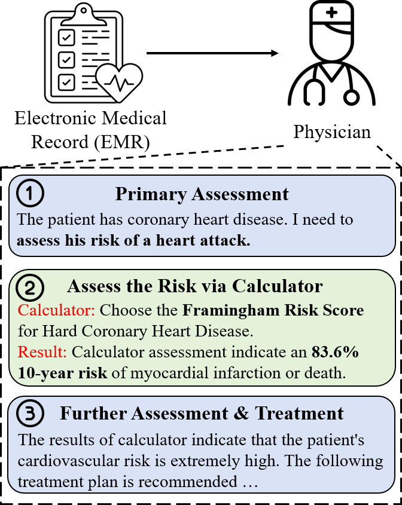
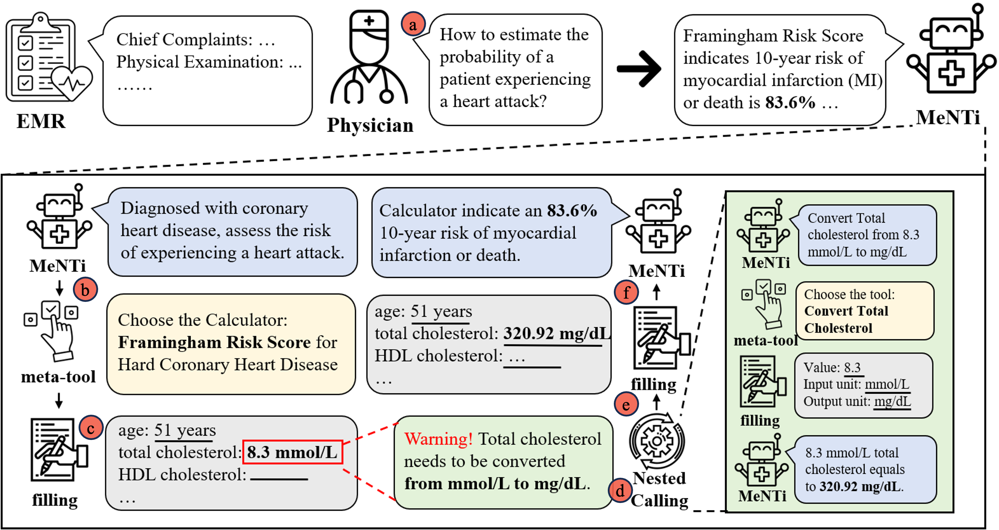

# MeNTi: Bridging Medical Calculator and LLM Agent with Nested Tool Calling

<p align="center">
  📄 <a href="https://arxiv.org/abs/2410.13610" target="_blank">Paper</a> &nbsp; | &nbsp;
  🤗 <a href="https://huggingface.co/datasets/shzyk/CalcQA" target="_blank">Hugging Face</a>
</p>

## Overview

Medical calculators are standardized tools widely used to quantitatively assess an individual's health status, functional levels, disease severity, and treatment outcomes. Here is an example of how calculators are applied in medical scenarios: physicians use calculators to assist in the quantitative assessment of a patient's condition based on their primary assessment.

<p align="center">        </p>

However, their application faces challenges, such as locating information within lengthy case histories, filling in data slots, and converting units. Additionally, selecting the appropriate tool remains a difficult task. Both traditional methods and current approaches to LLM tool application are insufficient.


To address these issues, we introduce the **CalcQA** benchmark, a new standard for evaluating the capabilities of LLMs in clinical calculator scenarios. It includes 100 calculator pairs based on real patient cases and 281 medical calculator tools. Furthermore, we develop the generalized **MeNTi** agent architecture, which expands LLMs' ability to tackle real-world medical calculator tasks through meta-tool and nested calling mechanisms. Our research demonstrates that MeNTi is the first **full-process implementation** of LLMs for calculator assessments in real medical scenarios, achieving outstanding performance in executing such tasks.

## MENTI

MeNTi utilizes the meta-tool for tool selection and the nested calling mechanism to assist LLMs in tool utilization. This approach enables MeNTi to address complex tasks in specialized scenarios with the specialized toolkit.

<p align="center">        </p>

Specifically, after the physician performs a primary assessment of the patient and determines the next steps for quantification, the task is handed over to MeNTi. Following the preliminary diagnosis, MeNTi uses the meta-tool to select the appropriate medical calculator. MeNTi then proceeds to fill in the slots of calculator parameters. If MeNTi detects a mismatch in parameter units, it employs the nested tool-calling mechanism. This allows for iterative tool selection and usage to resolve unit mismatches caused by complex toolchains that require multiple tools. Once the conversion tool's results are integrated, MeNTi continues to populate the calculator parameters and completes the final computation.

## CalcQA

CalcQA is a novel benchmark and toolkit featuring specialized medical tools designed to assess the ability of LLMs to perform end-to-end calculator assessment in clinical scenarios. It includes 100 calculator pairs based on real patient cases, along with 281 medical calculator tools. Experienced physicians were hired to select the appropriate calculators for each case and thoroughly document their rationale for the choices, their diagnostic opinions, and the results of the calculator assessments. [The Huggingface of the CalcQA](https://huggingface.co/datasets/shzyk/CalcQA) has been established.

## How to Use

To use this, first select the model and dataset you wish to use in `run_menti.sh`. The default options are GPT-3.5-turbo and m3e (note that you will need to configure the OpenAI API key and download the corresponding model weights from Huggingface in advance). The default dataset is `CalcQA`. Next, configure the interfaces for the LLM and embedding model you have selected in `Model.py`. Once everything is configured, simply execute `run_menti.sh`.

The required environment dependencies are listed in `requirements.txt`.

## Citation

Please kindly cite our paper if you find our method or code useful:

```
@article{zhu2024menti,
  title={MeNTi: Bridging Medical Calculator and LLM Agent with Nested Tool Calling},
  author={Zhu, Yakun and Wei, Shaohang and Wang, Xu and Xue, Kui and Zhang, Xiaofan and Zhang, Shaoting},
  journal={arXiv preprint arXiv:2410.13610},
  year={2024}
}
```

